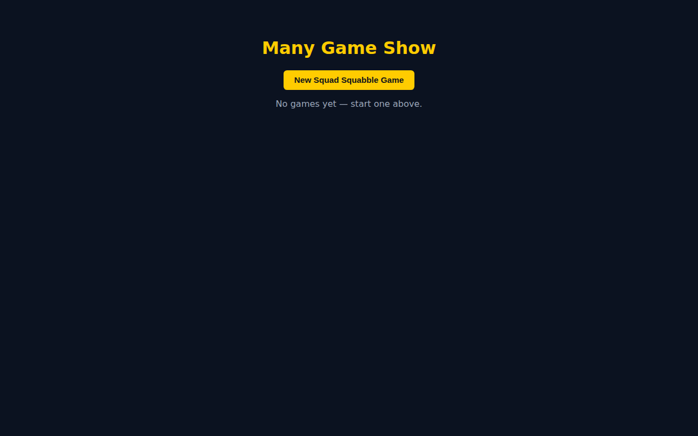
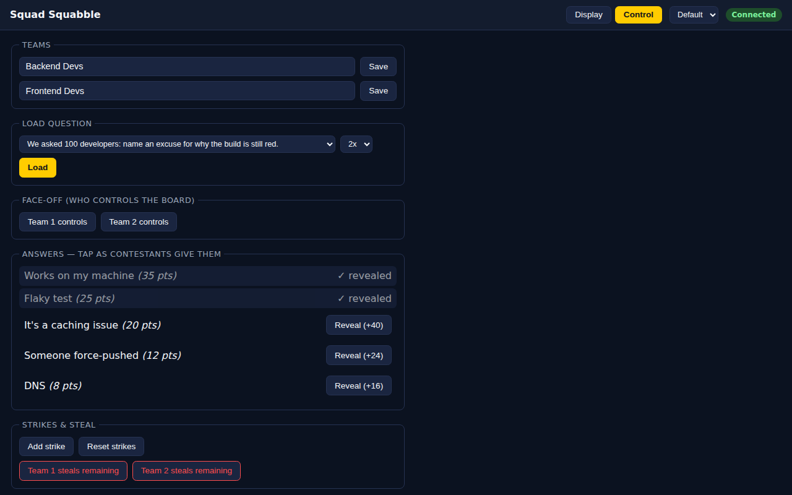
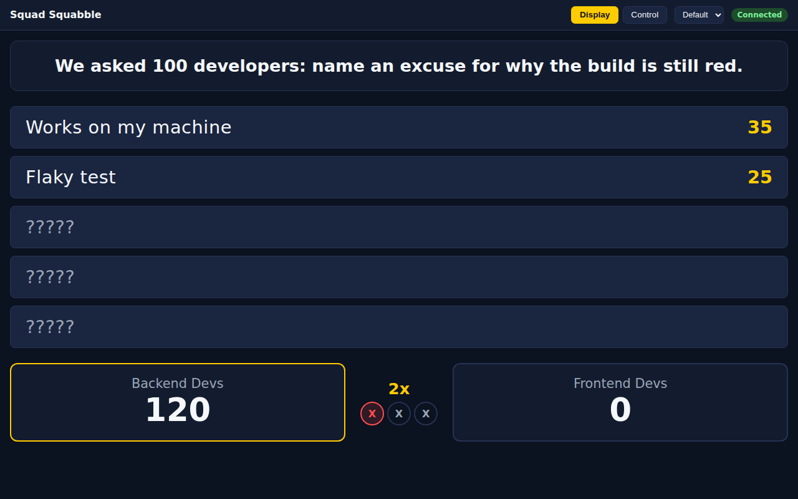
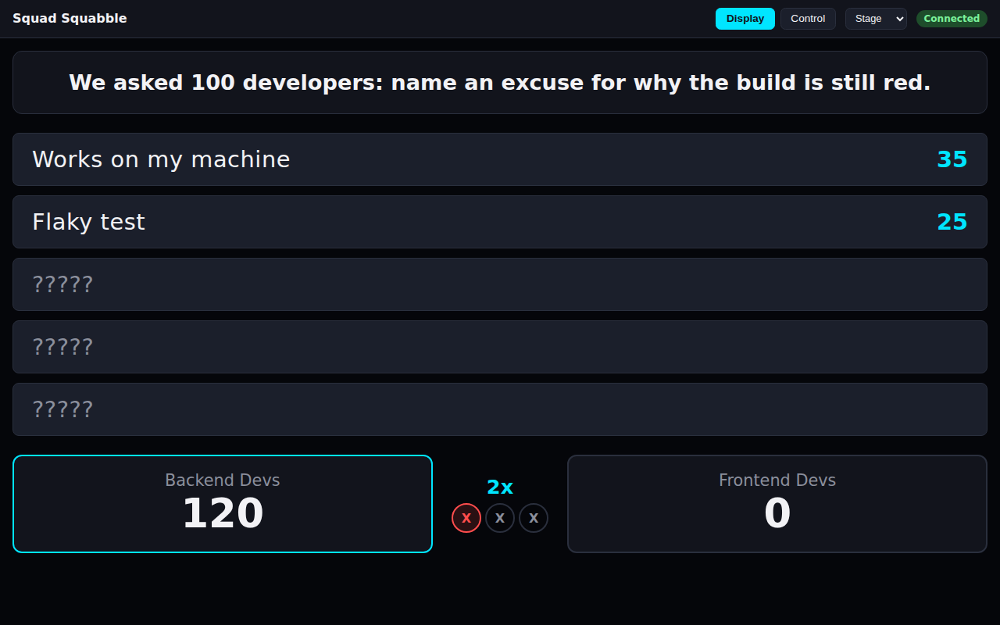

# Many Game Show

A multi-game-show web app, built for a "50 minutes, idea to working app"
conference session. FastAPI + SQLite backend, vanilla HTML/CSS/JS frontend,
no build step. See [ARCHITECTURE.md](./ARCHITECTURE.md) and
[UI_LOOK_AND_FEEL.md](./UI_LOOK_AND_FEEL.md) for the design behind it.

Currently implements **Squad Squabble** — a Family-Feud-style survey game.

---

## Screenshots

| Lobby | Control (host) |
|---|---|
|  |  |

| Display (default theme) | Display (stage theme) |
|---|---|
|  |  |

---

## Running it

Requires [uv](https://docs.astral.sh/uv/) and Python 3.13+ (uv will fetch
3.13 automatically if it's not already installed).

```bash
# Install dependencies
make sync
# (equivalent to: uv sync --extra dev)

# Run the dev server (hot-reload)
make run
# (equivalent to: uv run uvicorn manygameshow.main:app --reload)
```

Then open **http://localhost:8000** — click **New Squad Squabble Game**
from the lobby to create a game. That takes you to the Control view; open
`/squad-squabble.html?id=<the game id>&view=display` on a second
screen/tab for the big-screen Display view.

The SQLite database file (`manygameshow.db`) is created automatically on
first run. **If you change a model's fields, delete the db file and
restart** — there's no migration tooling (see ARCHITECTURE.md).

### Question content

Squad Squabble's questions live as data, not code, in
[`src/manygameshow/data/squad_squabble_questions.sample.json`](./src/manygameshow/data/squad_squabble_questions.sample.json) —
a small sample/test set. Point `SQUAD_SQUABBLE_QUESTIONS_PATH` at a
different JSON file (same shape) to swap in real content without
touching any code:

```bash
SQUAD_SQUABBLE_QUESTIONS_PATH=/path/to/real_questions.json make run
```

---

## Checks

```bash
make lint        # ruff + djlint
make typecheck    # mypy
make test-backend # pytest (models + API)
make test-ui       # Playwright, real browser
make check        # all of the above
```

See [`.github/workflows/ci.yml`](./.github/workflows/ci.yml) for what runs
in CI on every push/PR.

---

## Project docs

- [ARCHITECTURE.md](./ARCHITECTURE.md) — stack, conventions, extension pattern
- [UI_LOOK_AND_FEEL.md](./UI_LOOK_AND_FEEL.md) — theming, typography, view conventions
- [AIA_ATTRIBUTION.md](./AIA_ATTRIBUTION.md) — AI attribution statement used in commits
- [SESSION_LOG.md](./SESSION_LOG.md) — turn-by-turn build timing (see `scripts/session_timing.py`)
